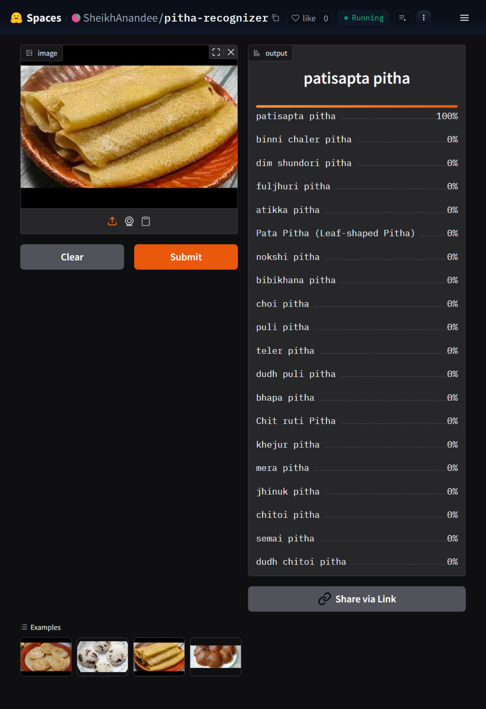

# Pitha-Recognizer
An image classification project covering the full pipeline — data collection, cleaning, model training, deployment, and API integration.  

<!--

 
-->

# Overview
Pitha-Recognizer can classify **20 different types of Pitha**(traditional Bengali rice cakes) from an image, and is deployed as a live, interactive web app.

# Types of Pitha

The model recognizes the following 20 categories of traditional Bengali Pitha:

|  | Pitha | Description |
|---|-------|--------------|
| 1 | **Bhapa Pitha** | Round, steamed rice cake, soft and pale white |
| 2 | **Chitoi Pitha** | Flat, round, spongy disc, usually served with jaggery syrup or milk. |
| 3 | **Tel er Pitha** | Deep-fried, puffy fritter with a golden-brown crust |
| 4 | **Nakshi Pitha** | intricate, hand-carved geometric and nature-inspired motifs.|
| 5 | **Bibikhana Pitha** | Dense, baked cake, golden-brown,cut into diamond or square pieces |
| 6 | **Puli Pitha** | Crescent-shaped dumpling with pleated, braided edges |
| 7 | **Patisapta Pitha** | White or pale golden crepe rolled around a jaggery, or kheer filling. |
| 8 | **Choi Pitha** | 	Small, dumplings, usually pale white and irregularly rounded |
| 9 | **Khejur Pitha** | Small, elongated, date-shaped fried sweet with a golden-brown surface|
| 10 | **Dudh Chitoi Pitha** | Round, spongy rice cake similar to Chitoi, served soaking in milk |
| 11 | **Bini Pitha** | white color rice cake made using binni (glutinous) rice, shaped like Patishapta |
| 12 | **Pata Pitha** | crispy, fried , folded shape resembling a leaf  |
| 13 | **Jhinuk Pitha** | Rice-flour dough shaped like a seashell, fried sweet with ridged, curved edges |
| 14 | **Mera Pitha** | white or slightly golden, shaped into small oval dumplings |
| 15 | **Chita Pitha** | Thin, lacy rice cake with a net-like, perforated  variation of chitoi pitha |
| 16 | **Dudh Puli Pitha** | Crescent-shaped coconut dumplings served submerged in sweetened milk |
| 17 | **Fuljhuri Pitha** | Crispy fried rice-flour pitha, often flower shaped decoratively. |
| 18 | **Semai Pitha** | Thin vermicelli strands, bundled made with fine rice-flour vermicelli |
| 19 | **Dim Shundori Pitha** | An egg-shaped and based sweet pitha with a rich, custard-like texture. |
| 20 | **Atikka Pitha** | sticky rice cake, rectangular shaped wrapped and steamed in banana leaves|

# Live Application
- **🤗 Hugging Face**: [Interactive Gradio App](https://huggingface.co/spaces/SheikhAnandee/pitha-recognizer)
- **🌐 Web App**: [GitHub Pages](https://sheikhanandee.github.io/Pitha-Recognizer/)

## Model Deployment
I deployed the model to HuggingFace Spaces Gradio App. The implementation can be found in the `deployment` folder or [here](https://huggingface.co/spaces/SheikhAnandee/pitha-recognizer).  

## API Integration with GitHub Pages
The deployed model's API is integrated into a [GitHub Pages website](https://sheikhanandee.github.io/Pitha-Recognizer/). Implementation and other details can be found in the `deployment` folder.  

# Dataset Preparation
**Data Collection:** Downloaded from DuckDuckGo using term name  
**DataLoader:** Used fastai DataBlock API to set up the DataLoader.  
**Data Augmentation:** fastai provides default data augmentation which operates in GPU.  
Details can be found in `notebooks/pitha_images_prep.ipynb`

# Training and Data Cleaning
**Training:** Experimented with three architectures — `resnet34`, `densenet121`, and `mobilenet_v3_large` — fine-tuning each with fastai's `vision_learner`. The `resnet34` model performed best and was selected as the final model, fine-tuned for 5 epochs (plus an additional fine-tuning pass) reaching up to 90% accuracy.  
**Data Cleaning:** This part took the highest time. Since I collected data from browser, there were many noises. Also, there were images that contained. I cleaned and updated data using fastai ImageClassifierCleaner. I cleaned the data each time after training or finetuning, except for the last time which was the final iteration of the model.  

# API integration with GitHub Pages
The deployed model API is integrated [here](https://sheikhanandee.github.io/Pitha-Recognizer/) in GitHub Pages Website. Implementation and other details can be found in `docs` folder.
